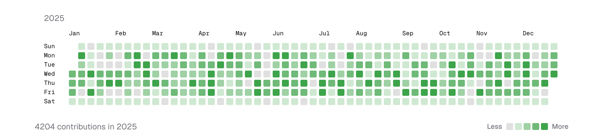
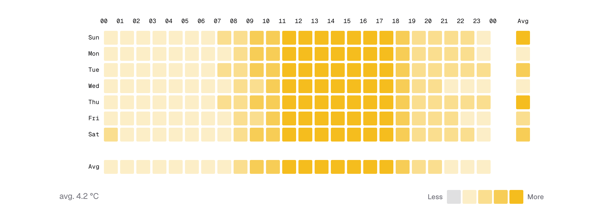
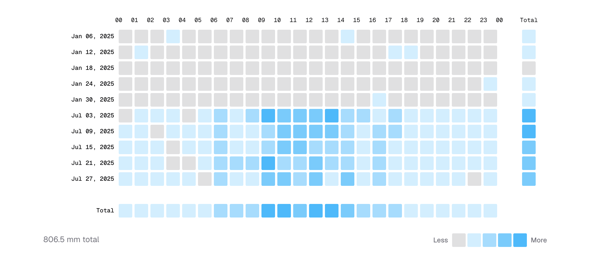
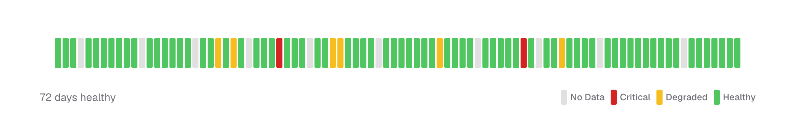

<div align="center">

# shadcn-heatmap

Heatmap components for React, built for [shadcn/ui](https://ui.shadcn.com).

**Live demo: [https://shadcn-heatmap.pages.dev](https://shadcn-heatmap.pages.dev)**

</div>

---

## Components

All four are single-file, zero-config components.

### CalendarHeatmap

GitHub-style yearly contribution calendar.



### WeekdayHeatmap

Weekday × hour-of-day matrix with optional Avg row and Avg column.



### DateHeatmap

One row per calendar date × 24 hours + a daily Sum column.



### StatusHeatmap

Timeline status indicator showing daily activity over a period.



## Requirements

- React 19+
- Tailwind CSS v4
- shadcn/ui project setup

## Installation

See the [/install page](https://shadcn-heatmap.pages.dev/install) for the interactive walkthrough. The steps below mirror it 1-to-1.

### shadcn CLI (recommended)

1. **Install via `shadcn@latest`.** Pick the component you need — the CLI writes it into your project's `components/heatmap/` directory.

   ```bash
   # CalendarHeatmap
   npx shadcn@latest add https://shadcn-heatmap.pages.dev/r/calendar-heatmap.json

   # WeekdayHeatmap
   npx shadcn@latest add https://shadcn-heatmap.pages.dev/r/weekday-heatmap.json

   # DateHeatmap
   npx shadcn@latest add https://shadcn-heatmap.pages.dev/r/date-heatmap.json

   # StatusHeatmap
   npx shadcn@latest add https://shadcn-heatmap.pages.dev/r/status-heatmap.json
   ```

2. **Ensure the runtime dependencies exist.**

   ```bash
   pnpm add date-fns clsx tailwind-merge @radix-ui/react-tooltip
   ```

3. **Install the shadcn tooltip component (optional but recommended).** The demos use tooltips to show activity details on hover.

   ```bash
   npx shadcn@latest add tooltip
   ```

### Manual

1. **Install peer dependencies.**

   ```bash
   pnpm add date-fns clsx tailwind-merge @radix-ui/react-tooltip
   ```

2. **Add the `cn` helper** (if not already present). Create `src/lib/utils.ts`:

   <!-- prettier-ignore -->
   ```ts
   import { clsx, type ClassValue } from "clsx";
   import { twMerge } from "tailwind-merge";

   export function cn(...inputs: ClassValue[]) {
     return twMerge(clsx(inputs));
   }
   ```

3. **Expose theme tokens used by the blocks.** The heatmaps reference `--color-chart-1` for activity colors, `--color-secondary` for empty cells, and `--color-muted-foreground` for labels. You can customize these via the `colors` prop.

   ```css
   /* src/styles/globals.css (Tailwind v4) */
   @import "tailwindcss";

   @theme {
     --color-secondary: oklch(96.7% 0.001 286.4);
     --color-chart-1: oklch(64.6% 0.222 41.1);
     --color-muted-foreground: oklch(55.2% 0.014 285.9);
   }
   ```

4. **Install the shadcn tooltip component (optional but recommended).** The demos use tooltips to show activity details on hover.

   ```bash
   npx shadcn@latest add tooltip
   ```

5. **Copy the component you need** from [`src/components/heatmap/`](https://github.com/rutopio/shadcn-heatmap/tree/master/src/components/heatmap) on GitHub and place it under `src/components/heatmap/` in your project.

## Usage

### CalendarHeatmap

```tsx
import {
  CalendarHeatmap,
  CalendarHeatmapBlock,
  CalendarHeatmapBody,
  CalendarHeatmapFooter,
  CalendarHeatmapLegend,
  CalendarHeatmapStat,
} from "@/components/heatmap/calendar-heatmap";

const data = [
  { date: "2024-01-01", value: 3 },
  { date: "2024-01-02", value: 7 },
  // ...
];

export default function Example() {
  return (
    <CalendarHeatmap data={data} weekStart={1}>
      <CalendarHeatmapBody>
        {({ activity, dayIndex, weekIndex }) => (
          <CalendarHeatmapBlock
            activity={activity}
            dayIndex={dayIndex}
            weekIndex={weekIndex}
          />
        )}
      </CalendarHeatmapBody>
      <CalendarHeatmapFooter>
        <CalendarHeatmapStat />
        <CalendarHeatmapLegend />
      </CalendarHeatmapFooter>
    </CalendarHeatmap>
  );
}
```

### WeekdayHeatmap

```tsx
import {
  WeekdayHeatmap,
  WeekdayHeatmapBlock,
  WeekdayHeatmapBody,
  WeekdayHeatmapFooter,
  WeekdayHeatmapLegend,
  WeekdayHeatmapStat,
} from "@/components/heatmap/weekday-heatmap";

// weekday: 0–6 (Sun–Sat)
// hour:    0–23
const data = [
  { weekday: 1, hour: 9, value: 16.3 },
  { weekday: 1, hour: 14, value: 22.1 },
  // ...
];

// Optional: aggregated row/column pass through `extraRow` / `extraColumn`.
// `compute` receives the full data; return 24 values for the row (by hour)
// or 7 values for the column (indexed by weekday 0–6).
const avgByHour = (d: typeof data) => {
  const sums = Array(24).fill(0);
  const counts = Array(24).fill(0);
  d.forEach((a) => {
    sums[a.hour] += a.value;
    counts[a.hour] += 1;
  });
  return sums.map((s, i) => (counts[i] ? s / counts[i] : 0));
};

export default function Example() {
  return (
    <WeekdayHeatmap
      data={data}
      isNormalized
      extraRow={{ label: "Avg", compute: avgByHour }}
    >
      <WeekdayHeatmapBody>
        {({ activity }) => <WeekdayHeatmapBlock activity={activity} />}
      </WeekdayHeatmapBody>
      <WeekdayHeatmapFooter>
        <WeekdayHeatmapStat />
        <WeekdayHeatmapLegend />
      </WeekdayHeatmapFooter>
    </WeekdayHeatmap>
  );
}
```

### DateHeatmap

```tsx
import {
  DateHeatmap,
  DateHeatmapBlock,
  DateHeatmapBody,
  DateHeatmapFooter,
  DateHeatmapLegend,
  DateHeatmapStat,
} from "@/components/heatmap/date-heatmap";

// date: YYYY-MM-DD
// hour: 0–23
const data = [
  { date: "2025-12-11", hour: 13, value: 8.4 },
  { date: "2025-12-11", hour: 14, value: 22.7 },
  // ...
];

// Optional: aggregated row / column via `extraRow` / `extraColumn`.
// Row `compute` returns 24 values (one per hour). Column `compute`
// receives `(data, dates)` and returns one value per date.
const sumByHour = (d: typeof data) => {
  const out = Array(24).fill(0);
  d.forEach((a) => {
    out[a.hour] += a.value;
  });
  return out;
};
const sumByDate = (d: typeof data, dates: string[]) =>
  dates.map((date) =>
    d.filter((a) => a.date === date).reduce((s, a) => s + a.value, 0)
  );

export default function Example() {
  return (
    <DateHeatmap
      data={data}
      extraRow={{ label: "Total", compute: sumByHour }}
      extraColumn={{ label: "Total", compute: sumByDate }}
    >
      <DateHeatmapBody>
        {({ activity, dateIndex }) => (
          <DateHeatmapBlock activity={activity} dateIndex={dateIndex} />
        )}
      </DateHeatmapBody>
      <DateHeatmapFooter>
        <DateHeatmapStat />
        <DateHeatmapLegend />
      </DateHeatmapFooter>
    </DateHeatmap>
  );
}
```

### StatusHeatmap

```tsx
import {
  StatusHeatmap,
  StatusHeatmapBlock,
  StatusHeatmapBody,
  StatusHeatmapFooter,
  StatusHeatmapLegend,
  StatusHeatmapStat,
} from "@/components/heatmap/status-heatmap";

// value: 0 = no data, 1 = critical, 2 = degraded, 3 = healthy
const data = [
  { date: "2025-01-01", value: 3 },
  { date: "2025-01-02", value: 2 },
  { date: "2025-01-03", value: 1 },
];

export default function Example() {
  return (
    <StatusHeatmap data={data}>
      <StatusHeatmapBody>
        {({ activity, dayIndex }) => (
          <StatusHeatmapBlock activity={activity} dayIndex={dayIndex} />
        )}
      </StatusHeatmapBody>
      <StatusHeatmapFooter>
        <StatusHeatmapStat />
        <StatusHeatmapLegend />
      </StatusHeatmapFooter>
    </StatusHeatmap>
  );
}
```

See the [live demo](https://shadcn-heatmap.pages.dev) for full examples of all four components, including tooltips, i18n, and custom colors.

## Contributing

Contributions are warmly welcome. Whether it's a bug report, a new variant idea, a11y improvement, or docs polish — feel free to open an [issue](https://github.com/rutopio/shadcn-heatmap/issues) or send a pull request.

If you're adding a new component or changing the public API, please open an issue first so we can align on scope before you write the code.

### Local setup

Requires Node 20+ and pnpm 10.

```bash
pnpm install
pnpm dev            # start the demo site on http://localhost:5173
```

### Project layout

- `src/components/heatmap/` — the four heatmap components. Each file is self-contained so the shadcn registry can ship it as a single copy-paste unit. **Do not reach into shared modules from here.**
- `src/components/ui/` — shadcn/ui primitives (button, tabs, tooltip, …).
- `src/components/site/` — demo site chrome (header, footer, theme toggle).
- `src/docs/` — everything that powers the demo site for a component:
  - `<name>/demos.tsx` — concrete demo variants shown on the page
  - `<name>/variants.tsx` — the variant-grid config for `/routes/<name>`
  - `<name>/props.ts` — props-table data
  - `<name>/snippets.ts` — code snippets displayed inline
  - `_frame/` — page-layout building blocks (`DemoFrame`, `PropsTable`, `ShowcaseSection`, `VariantGrid`)
  - `_shared/tooltips.tsx` — tooltip helpers reused by demos
  - `install.ts`, `types.ts` — docs-wide content
- `src/data/` — JSON sample datasets imported by demos.
- `src/routes/` — TanStack Router pages (`routeTree.gen.ts` is auto-generated).
- `src/lib/` — small utilities (`cn`, `shiki`, `time`, `seo`).
- `scripts/build-registry.ts` — generates `public/r/*.json` consumed by `shadcn@latest add`. **Only reads `src/components/heatmap/`** — `src/docs/` is never shipped to consumers.

**Rule of thumb**: if it ships to a user's project via the registry, it lives in `src/components/heatmap/`; if it only runs on the demo site, it lives in `src/docs/`.

### Commits and branches

- Branch from `master` using a short descriptive name (`fix/status-empty-data`, `feat/binary-heatmap`).
- Keep commits focused; prefer a series of small commits over one large one.
- Commit messages are lowercase imperative, short (see recent history for the flavour).

### Before opening a PR

Run the same checks CI runs — merges are blocked if they fail:

```bash
pnpm run check      # audit + format + lint + typecheck
pnpm run build      # build the registry + the demo site
```

If your change touches a component in `src/components/heatmap/`, open the demo site and verify the affected variant renders correctly — there is no test suite, so visual verification is the safety net.

## License

MIT License
